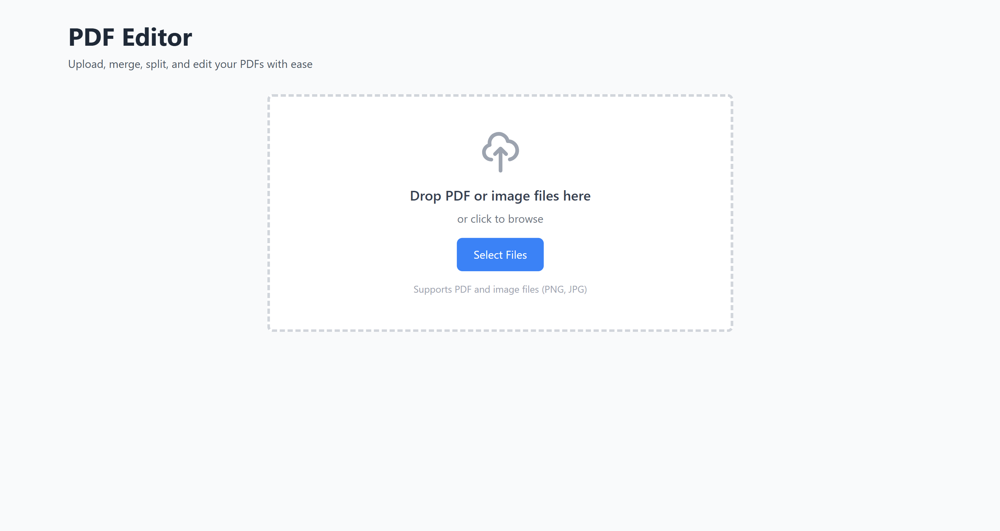
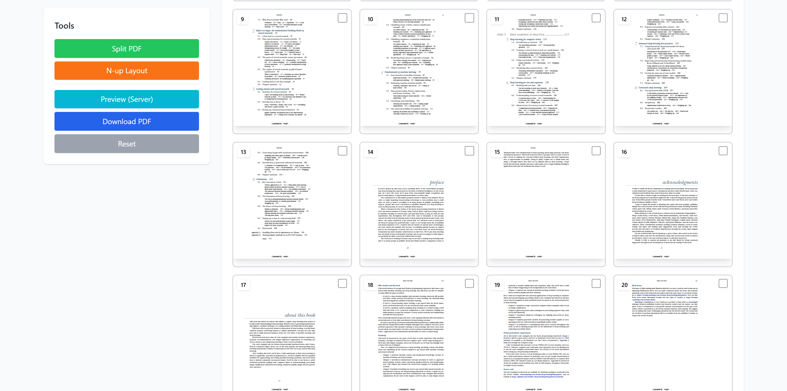

# PDF Editor

A comprehensive PDF editing web application built with Next.js 14+ (App Router), React, and Express. Features include merging, splitting, rotating, N-up layouts, image insertion, and more.

## Features

### Client-Side Operations
- **Upload**: Single or multiple PDFs and images (PNG/JPG)
- **Merge PDFs**: Combine multiple PDFs into one (client or server-side)
- **Split PDFs**: 
  - Visual page selection with checkbox thumbnails
  - Numeric range input (e.g., "1-3, 5, 7-10")
  - Batch export of extracted ranges
- **Add Images**: Upload and place images on PDF pages with drag-and-resize
- **N-up Layout**: Arrange 2, 4, or 6 pages per sheet
  - Configurable spacing and margins
  - Portrait/landscape orientation
  - Client or server-side processing
- **Page Operations**:
  - Rotate pages (90° increments)
  - Delete pages
  - Reorder pages (drag-and-drop)
- **Reset**: Revert to original uploaded files
- **Download**: Save edited PDFs locally

### Backend Operations (for large files)
- **Merge**: Server-side PDF merging
- **N-up**: Server-side N-up layout generation
- **Preview**: Optimized preview generation for large PDFs (50+ pages)

### Live Preview
- Real-time PDF rendering using `react-pdf`
- Thumbnail grid view with page selection
- Visual feedback for all operations
- Server-side preview option for large files


## Demo

<p align="center">
  
  
</p>


## Tech Stack

### Frontend
- **Next.js 14+** (App Router)
- **React 18+**
- **Tailwind CSS** for styling
- **pdf-lib** for client-side PDF manipulation
- **react-pdf** for PDF rendering and preview

### Backend
- **Node.js** with **Express**
- **pdf-lib** for server-side PDF operations
- **multer** for file upload handling
- **sharp** for image processing

## Installation

1. **Clone or navigate to the project directory:**
   ```bash
   cd C:\Users\srhar\OneDrive\Documents\project\DW\pdfedx
   ```

2. **Install dependencies:**
   ```bash
   npm install
   ```

3. **Set up environment variables:**
   The `.env.local` file is already configured with:
   ```
   NEXT_PUBLIC_API_URL=http://localhost:3001
   ```

## Running the Application

### Development Mode

Run both frontend and backend simultaneously:
```bash
npm run dev
```

This will start:
- Next.js frontend on `http://localhost:3000`
- Express backend on `http://localhost:3001`

### Run Frontend Only
```bash
npm run dev:next
```

### Run Backend Only
```bash
npm run dev:server
```

### Production Mode

1. **Build the frontend:**
   ```bash
   npm run build
   ```

2. **Start both services:**
   ```bash
   npm start
   ```

## Usage Guide

### 1. Upload Files
- Drag and drop PDF or image files onto the upload area
- Or click "Select Files" to browse
- Multiple files can be uploaded at once

### 2. Merge PDFs
- Upload 2+ PDF files
- Click "Merge PDFs (Client)" for client-side processing
- Or "Merge PDFs (Server)" for large files

### 3. Split PDFs
- Click "Split PDF" button
- Enter page ranges (e.g., "1-3, 5-8, 10")
- Or select pages visually using checkboxes
- Click "Extract Selected" to export selected pages

### 4. Add Images
- Upload both PDF and image files
- Click "Add Image"
- Select image, target page, position, and size
- Click "Place Image"

### 5. N-up Layout
- Click "N-up Layout"
- Choose pages per sheet (2, 4, or 6)
- Adjust spacing and margins
- Select orientation
- Toggle server-side processing for large files
- Click "Apply N-up Layout"

### 6. Page Operations
- **Select a page** to enable rotation and deletion
- **Drag thumbnails** to reorder pages
- Click "Rotate 90°" to rotate selected page
- Click "Delete Page" to remove selected page

### 7. Preview & Download
- Live preview updates after each operation
- Click "Preview (Server)" for optimized server-side preview
- Click "Download PDF" to save your edited document
- Click "Reset" to revert all changes

## API Endpoints

### POST `/api/merge`
Merge multiple PDF files
- **Body**: FormData with multiple `pdfs` files
- **Response**: Merged PDF file

### POST `/api/split`
Split PDF into ranges
- **Body**: FormData with `pdf` file and `ranges` JSON
- **Response**: JSON with base64-encoded split PDFs

### POST `/api/add-image`
Add image to PDF page
- **Body**: FormData with `pdf`, `image`, and placement parameters
- **Response**: Modified PDF file

### POST `/api/nup`
Create N-up layout
- **Body**: FormData with `pdf` file and `config` JSON
- **Response**: N-up layout PDF file

### POST `/api/preview`
Generate optimized preview
- **Body**: FormData with `pdf` file
- **Response**: Optimized preview PDF (first 50 pages for large files)

### GET `/health`
Health check endpoint
- **Response**: `{ status: 'ok', message: 'PDF Editor API is running' }`

## Project Structure

```
pdfedx/
├── app/
│   ├── layout.js          # Root layout
│   ├── page.js            # Home page
│   └── globals.css        # Global styles
├── components/
│   ├── PDFEditor.js       # Main editor component
│   ├── FileUpload.js      # File upload component
│   ├── PDFPreview.js      # PDF preview with thumbnails
│   ├── Toolbar.js         # Tools and operations
│   ├── ProgressBar.js     # Progress indicator
│   └── ErrorMessage.js    # Error display
├── server/
│   └── index.js           # Express API server
├── package.json           # Dependencies and scripts
├── next.config.js         # Next.js configuration
├── tailwind.config.js     # Tailwind CSS configuration
├── postcss.config.js      # PostCSS configuration
├── jsconfig.json          # JavaScript configuration
├── nodemon.json           # Nodemon configuration
├── .env.local             # Environment variables
└── README.md              # This file
```

## Browser Compatibility

- Chrome/Edge (recommended)
- Firefox
- Safari
- Modern browsers with ES6+ support

## Performance Considerations

- **Client-side operations** are suitable for files up to ~20MB
- **Server-side operations** are recommended for:
  - Files larger than 20MB
  - Merging 5+ PDFs
  - N-up layouts with 50+ pages
- Preview generation limits large PDFs to first 50 pages

## Troubleshooting

### PDF.js Worker Error
If you see worker-related errors, ensure the CDN URL is accessible:
```javascript
pdfjs.GlobalWorkerOptions.workerSrc = `//cdnjs.cloudflare.com/ajax/libs/pdf.js/${pdfjs.version}/pdf.worker.min.js`;
```

### CORS Issues
Ensure the backend server is running and the `NEXT_PUBLIC_API_URL` environment variable is correctly set.

### Large File Handling
For files larger than 100MB, you may need to adjust the multer limits in `server/index.js`:
```javascript
limits: {
  fileSize: 200 * 1024 * 1024, // 200MB
}
```

## Contributing

Contributions are welcome! Please feel free to submit a Pull Request.

## Support

For issues or questions, please open an issue on the repository.
